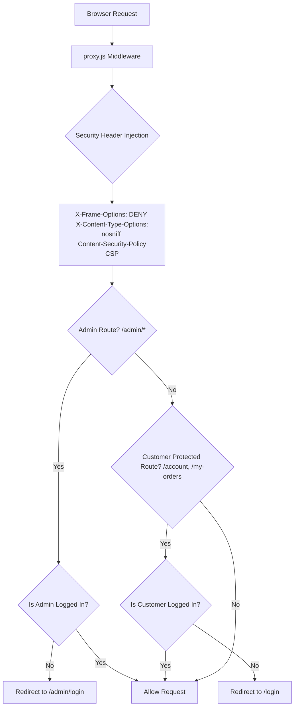
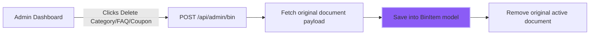

# 📚 DigitalVault - Developer Flow & Architecture Guide

Welcome, Developer! This guide is written to help you understand the end-to-end architecture, backend-to-frontend flows, API request cycles, and security mechanics of the **DigitalVault** platform. 

Whether you are a beginner or an experienced engineer, this document maps out exactly how data flows through the files, how payments are processed, and how the platform protects itself from attacks.

---

## 🗺️ 1. Project Architecture & File Mapping

DigitalVault is built using **Next.js 14/15 App Router** (React 19, Turbopack), **MongoDB** (via Mongoose), **Tailwind CSS**, and integrates **Razorpay** (payments) and **Cloudinary** (media CDN).

Here is a simplified directory map of where crucial logic lives:

```text
digitalvault/
├── app/
│   ├── page.jsx                    ← Storefront page (dynamic client settings + products grid)
│   ├── login/page.jsx              ← Customer login (Google/OTP/Password logic)
│   ├── my-downloads/page.jsx       ← Customer download shelf (loads normal + bundle products)
│   ├── admin/
│   │   ├── dashboard/page.jsx      ← Executive analytics dashboard & CMS editor
│   │   ├── settings/page.jsx       ← App configs (Razorpay, Admin keys, Trash TTL)
│   │   └── bundle/page.jsx         ← Subscriber mega-bundle manager & customer list
│   └── api/
│       ├── settings/route.js       ← Configurations GET & POST api
│       ├── upload/route.js         ← Direct file uploading API (Cloudinary / local disk)
│       ├── download/route.js       ← Single product secure tokenized file streaming API
│       ├── customer/route.js       ← Customer authentications and profile metrics
│       ├── bundle/
│       │   ├── create-order/       ← Razorpay checkout order initializer API
│       │   ├── verify-payment/     ← Razorpay checkout verification & grant logic API
│       │   └── download/[id]       ← Secure bundle subscription file streaming API
│       └── stats/route.js          ← Real-time admin aggregator panel statistics API
├── components/
│   ├── Navbar.jsx                  ← Stores checkout carts & links
│   ├── ProductCard.jsx             ← Individual store items with "Access Now" or "Buy" triggers
│   └── MobileBottomNav.jsx         ← Custom mobile layout controls
├── lib/
│   ├── mongodb.js                  ← Database connector engine
│   ├── auth.js                     ← JSON Web Tokens (JWT) signers and authenticators
│   ├── security.js                 ← Application-layer IP rate limit engines
│   └── bundle-access.js            ← Helper to compute subscriber bundle statuses
├── models/
│   ├── Setting.js                  ← Stores site parameters (appName, keys, Trash TTL, etc.)
│   ├── Product.js                  ← Digital items schema (price, included_in_bundle, etc.)
│   ├── Order.js                    ← Records normal purchases with tokenized keys
│   ├── BundleSubscription.js       ← Records complete package subscriber memberships
│   └── ApiThrottle.js              ← DDoS IP records (backed by auto-expiring TTL index)
└── proxy.js                        ← Route guard & security header interceptor (Middleware)
```

---

## 🔒 2. Custom Security Middleware & Route Guards (`proxy.js`)

Before any HTTP request hits the Next.js pages or API routes, it passes through **`proxy.js`** (the system middleware). It acts as the gatekeeper.



### The Security Shield (Content Security Policy)
The middleware injects security headers on every response to protect against web exploits:
* **X-Frame-Options (DENY)**: Blocks clickjacking by preventing the website from being loaded inside an `<iframe>` on other domains.
* **X-Content-Type-Options (nosniff)**: Forces the browser to strictly follow the defined MIME types, blocking script injection payloads masquerading as images.
* **Content-Security-Policy (CSP)**: Defines exactly which origins can load scripts, stylesheets, and fonts.
  * `img-src 'self' data: blob: https://res.cloudinary.com https://*.googleusercontent.com`: Blocks unauthorized third-party image domains, allowing only verified media from local storage, Cloudinary, and Google profiles.

---

## 👤 3. Customer Authentication & Session Lifecycle

DigitalVault supports **Password Login**, **Google OAuth (Sign-In)**, and **One-Time Passwords (OTP)** via Email or Mobile.

```mermaid
sequenceDiagram
    autonumber
    actor User as Browser Client
    participant API as /api/customer
    participant JWT as lib/auth.js
    participant DB as MongoDB (Setting/Customer)

    User->>API: POST /api/customer { action: "login", email, password }
    API->>DB: Query customer by Email
    DB-->>API: Customer Record found (Password Hashed)
    API->>API: bcrypt.compare(password, hash) validation
    
    rect rgb(20, 20, 30)
        Note over API,JWT: Generate JWT Token
        API->>JWT: signCustomerToken(customer)
        JWT-->>API: Returns encrypted JWT string
    end

    API-->>User: Sends HTTP response + sets Cookie 'dv_customer_token' (HttpOnly, Secure)
    Note right of User: Saved in browser cookies securely. Next requests will auto-include it.
```



### Key Security Design Features:
1. **HttpOnly Cookies**: JWT session tokens are stored in `HttpOnly` cookies. This means browser-side JavaScript *cannot* access or read them, making it impossible for malicious cross-site scripting (XSS) attacks to steal active sessions.
2. **Double Password Hashing**: Passwords are encrypted on creation/update inside `/api/customer` using `bcryptjs` with a cost factor of 10. Raw passwords are never stored in the database.
3. **Google GSI SDK Fallbacks**: Google login mounts GSI script dynamically using `<Script strategy="afterInteractive" />`. If local adblockers block Google from loading, a high-fidelity custom Apple-style fallback button is displayed to elegantly inform the user to adjust their extensions.

---

## 🛒 4. The Complete E-Commerce Buying Flow

Here is how a purchase flows through the codebase when a customer unlocks the **Complete Bundle**:

```mermaid
sequenceDiagram
    autonumber
    actor Customer as Customer (Browser)
    participant Cart as localStorage Cart
    participant API as /api/bundle/create-order
    participant RP as Razorpay API Gateway
    participant Verify as /api/bundle/verify-payment
    participant DB as MongoDB (BundleSubscription)

    Customer->>Cart: Clicks "Unlock Bundle" -> Stores bundle details in localStorage
    Customer->>Customer: Customer proceeds to /cart and clicks checkout
    Customer->>API: POST /api/bundle/create-order { couponCode }
    API->>DB: Connects and verifies dynamic setting price & coupon validity
    API->>RP: Initiates Order request with calculated price in Paise (INR)
    RP-->>API: Returns unique Razorpay Order ID (rzp_order_xxx)
    API-->>Customer: Sends Order ID, key, and user profile details
    
    rect rgb(20, 25, 35)
        Note over Customer,RP: Razorpay Checkout Dialog mounts in iframe
        Customer->>RP: Pays via UPI / Card / Wallet
        RP-->>Customer: Returns Payment ID & Signature Token
    end

    Customer->>Verify: POST /api/bundle/verify-payment { orderId, paymentId, signature }
    Verify->>Verify: Re-creates dynamic signature HMAC-SHA256 using API Secret
    alt Signature Matches (Valid Payment)
        Verify->>DB: Saves BundleSubscription (customer_id, payment_id, status: 'active')
        Verify->>Cart: Clears checkout cart
        Verify-->>Customer: Returns { flag: 1, message: "Purchase Success!" }
        Customer->>Customer: Redirects to /my-downloads
    else Signature Fails (Fraud Attempt)
        Verify-->>Customer: Returns { flag: 0, message: "Invalid Signature" }
    end
```



---

## 📥 5. The Secure Download Delivery Flow

DigitalVault uses an extremely robust and secure design to prevent digital piracy. Paid users cannot leak files, and non-paying users cannot steal download links.

```mermaid
graph TD
    A[Customer on /my-downloads] --> B{Bundle Product or Normal Purchase?}
    
    B -- Bundle Product --> C[Link: /api/bundle/download/productId]
    B -- Single Purchase --> D[Link: /api/download?token=downloadToken&pid=productId]

    C --> E[Verify JWT cookie session <br> Check block status]
    E --> F[Check if customer has active BundleSubscription]
    F -- No --> G[HTTP 403 Forbidden]
    F -- Yes --> H[Check if product.included_in_bundle === true]
    H -- No --> G
    H -- Yes --> I[DDoS IP Rate Limiting Shield]

    D --> J[Query Order by download_token & payment_status === 1]
    J -- Not Found --> G
    J -- Found --> K[Check if order.token_expires_at > Now]
    K -- Expired --> L[HTTP 403 Download Expired]
    K -- Valid --> M[Check if order.product_id === pid]
    M -- No --> G
    M -- Yes --> I

    I --> N[Consume rate limit slot from ApiThrottle database]
    N -- Exceeded > 15 req/min --> O[HTTP 429 Too Many Requests]
    N -- Allowed --> P{Is file_url remote HTTP or local storage?}

    P -- Remote Link e.g. S3/Google Drive --> Q[Server fetches stream securely in background]
    Q --> R[Return new NextResponse(upstream.body, headers)]
    Note right of R: Content-Disposition attachment header forced. <br> Remote URL never leaked to browser logs!

    P -- Local Path e.g. /public/uploads/ --> S[Read buffer from disk and stream to client]
```

### Key Security & Infrastructure Protections:
1. **Server-Side File Streaming**: The server acts as a secure buffer. The browser only sees `NextResponse(upstream.body)`. The real location of the file (AWS S3 bucket, Google Drive direct link, local path) is **never** shared, preventing users from sharing direct files with non-paying users.
2. **IP-Based DDoS Rate-Limiting**: High-volume downloads consume extensive bandwidth and server memory. To prevent automated scraping bots or hackers from running infinite download scripts (exhausting server resources), we enforce a **15 requests/minute rate-limiter** per IP address.
   * Rates are tracked in `models/ApiThrottle.js`. When a limit is hit, the API responds with a `429 Too Many Requests` code and includes a `Retry-After` header telling the client exactly how many seconds they must wait.

---

## 🗑️ 6. The CMS Recycle Bin (Trash) System

To prevent accidental deletions of customer reviews, promo coupons, FAQs, and testimonials, the system uses a premium **Recycle Bin (Trash) Architecture**.



### How the Recycle Bin Works Under the Hood:
1. **Payload Encapsulation**: Deleted items are saved inside `BinItem.js`. It contains fields for the `original_id`, `type` (e.g. 'faqs', 'coupons'), `deleted_by`, and encapsulates the entire deleted document in a generic `data: Schema.Types.Mixed` object.
2. **Automated Purging with Zero-Overhead TTL**:
   The admin panel lets you configure a dynamic retention period (e.g. 30 days). Expired trash is permanently cleared automatically by MongoDB in the background, using a native TTL index:
   ```javascript
   BinItemSchema.index({ auto_delete_at: 1 }, { expireAfterSeconds: 0 });
   ```
   MongoDB's background threads monitor this index and delete expired trash instantly, requiring zero server scripts, cron jobs, or database queries.
3. **Collision-Safe Restores**:
   If an admin restores a deleted Coupon code (e.g. `NEWYEAR50`) or Category slug, but a new active coupon or category with that same code/slug has been created in the meantime, standard databases crash due to unique index violations. 
   DigitalVault prevents this by automatically appending dynamic safe-guards:
   * Duplicate category slug: `sports` -> `sports-restored`
   * Duplicate coupon code: `SAVE10` -> `SAVE10_RESTORED`

---

## 📝 7. Content Sanitization (Input Sanitizer Shield)

To defend the application against **Cross-Site Scripting (XSS)** injections, dynamic text edits (like product descriptions or layout paragraphs) pass through a strict HTML sanitizer in `/lib/sanitize-content.js`:

```javascript
import sanitizeHtml from 'sanitize-html';

export function sanitizeRichText(dirty) {
  return sanitizeHtml(dirty, {
    allowedTags: [ 'h1', 'h2', 'h3', 'h4', 'h5', 'h6', 'blockquote', 'p', 'a', 'ul', 'ol',
      'nl', 'li', 'b', 'i', 'strong', 'em', 'strike', 'code', 'hr', 'br', 'div',
      'span', 'img' ],
    allowedAttributes: {
      a: [ 'href', 'name', 'target', 'rel' ],
      img: [ 'src', 'alt', 'title', 'width', 'height' ],
      '*': [ 'style', 'class' ]
    },
    allowedSchemes: [ 'http', 'https', 'mailto', 'tel', 'data' ]
  });
}
```
Any embedded `<script>`, `onload` handlers, or dangerous iframe loops injected into CMS fields are cleanly stripped out server-side before saving to MongoDB, keeping the client safe.

---

*Congratulations! You now have a complete conceptual map of the entire DigitalVault platform. Happy Coding!*
